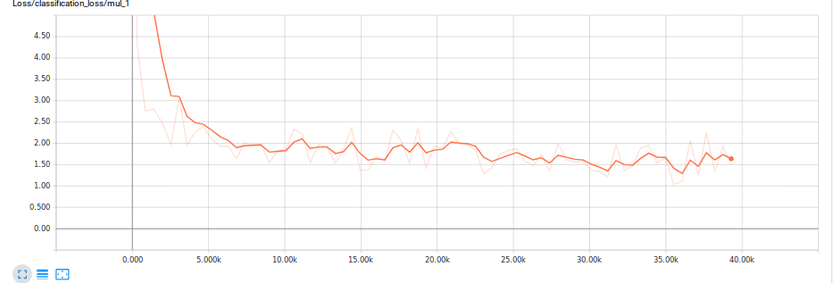
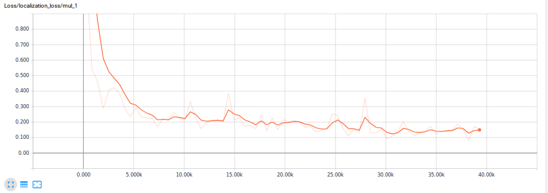

# Tokunaga Herrera Oscar Skycatch Coding Challenge Model

# ARCHITECTURE CHALLENGE

https://docs.google.com/document/d/1EX6Y-oFsJZVAUyBrVJTUe2ruxGRhT5jXJJhy9QDr3sA/edit?usp=sharing

# CODING CHALLENGE

## DOCUMENTATION

[VIDEO YOUTUBE!](https://www.youtube.com/watch?v=xzKb2DJ3PJ0)


"Creating accurate machine learning models capable of localizing and identifying multiple objects in a single image remains a core challenge in computer vision. The TensorFlow Object Detection API is an open source framework built on top of TensorFlow that makes it easy to construct, train and deploy object detection models. At Google we’ve certainly found this codebase to be useful for our computer vision needs, and we hope that you will as well"

<p align="center">
  
</p>

In order to make work an easy task, the tensorflow [Object Detection](https://github.com/tensorflow/models/tree/master/research/object_detection) was used. Throughout the development of the work, other options were considered as the use of Keras and Tensorflow or another API's such as YOLO. However, Object Detection API was selected since it is possible to train it in the cloud with [Google Cloud Platform](https://console.cloud.google.com). Saving us of valuable time and computing resources.

The present project contains two branches.

* A model trained and ready for use :)
* A clean model waiting for you to train it!

So let's get serious!


## Are you ready?

Clone the Skycatch project
``` bash
https://github.com/Toku11/Skycatch.git

``` 

The first thing you need to do is to create an environment in conda

``` bash
#From /Skycatch
conda env create -f environment.yml
source activate Skycatch1
```

NOTE : unfortunately I do not have a nvidia card so I do not add anything related

# NOT TRAINED MODEL 
## (OPTIONAL STEPS)

** If you don't want do the follow steps...All the files can be downloaded from my GCP:
* [train record](https://storage.cloud.google.com/skycatchdata1/data/train.record?_ga=2.133732493.-2095829079.1515573260) and  [test record](https://storage.cloud.google.com/skycatchdata1/data/test.record?_ga=2.20682043.-2095829079.1515573260) add to ./Skycatch/data1 folder

OTHERWISE 
----------------------------------------------------------------

Tensorflow Object Detection API uses TFRecord file format for datasets, so we need to convert our datases to this file format, but don't worry just...

``` bash
#From /Skycatch
git checkout Skycatchclean
```

Download your [dataset](https://drive.google.com/drive/folders/0B2pn1FoOPXh0ZXoxT0RqRUxOcm8), rename the dataset folder as FINAL and move it into ./Skycatch/  .


``` bash
#From /Skycatch
sh autostart.sh 
```
or open autostart.sh and copy line by line the commands


Now you have a clean Dataset into images and annotations folder, a csv table and a TFRecord file for train and test

## Train your model
### LINKS


For training you need the following:

* An object detection training pipeline in /Skycatch/training/ if you want another see [config files](https://github.com/tensorflow/models/tree/master/research/object_detection/samples/configs)
and adjust the num_classes to 3. Then set the path for the model
 [checkpoint](https://github.com/tensorflow/models/blob/master/research/object_detection/g3doc/detection_model_zoo.md) .It is recommended to use a checkpoint as it's always better to start from pre-trained models.

* Edit the /Skycatch/training/object-detection.pbtxt to the numbrer of classes that you need, i have four because some .XML files have another labels like cars. 

* Edit .config paths to records files and checkpoints

* Add to your bashrc
``` bash
sudo nano .bashrc " export PYTHONPATH="${PYTHONPATH}:/home/{username}/Skycatch/models/research/:/home/{username}/Skycatch/models/research/slim/" "
```
or run from every new terminal you start.

NOTE:

for cloud training we'll use ssd_mobilenet_v1_pets.config 
for local training we'll use ssd_mobilenet_v1_pets_off.config 


## Train locally 


A local training job can be run with the following command:
``` bash
# From /Skycatch
python models/research/object_detection/train.py --logtostderr --pipeline_config_path=training/ssd_mobilenet_v1_pets_off.config --train_dir=training/
```

## Evaluate 
The eval job will periodically poll the train directory for new checkpoints and evaluate them on a test dataset. The job can be run using the following command:
``` bash
# From Skycatch
python ./models/research/object_detection/eval.py     --logtostderr     --pipeline_config_path=training/ssd_mobilenet_v1_pets_off.config     --checkpoint_dir=./training     --eval_dir=eval
```
Progress for training and eval jobs can be inspected using Tensorboard. Tensorboard can be run using the following command:
``` bash
# From /Skycatch
tensorboard --logdir=./training
```

## Train Google Cloud Platform 

First install  conda install -c bioconda google-cloud-sdk  in your environment, create an account in GC and link it with:

``` bash
gcloud init
```

configure us-central1

NOTE: Object detection module was modified in order to correct dependency errors **matplotlib**

For Google Cloud, you need to define a YAML configuration file ./training/cloud.yml . The YAML file should be saved on the local machine (not on GCP).


In order to run the Tensorflow Object Detection API on Cloud ML, it must be packaged (along with it's TF-Slim dependency). The required packages can be created with the following command

``` bash
# From Skycatch/models/research/
python setup.py sdist
(cd slim && python setup.py sdist)
```

This will create python packages in dist/object_detection-0.1.tar.gz and
slim/dist/slim-0.1.tar.gz.

* Create a bucket in GCP and add a folder named "data", where you will upload test.record, train.record, object-detection.pbtxt, ssd_mobilenet_v1_pets.config and ssd_mobilenet_v1_coco_2017_11_17 folder. ** Don't forget to edit first the "config" file in order to link your bucket name.

A user can start a training job on Cloud ML Engine using the following command:
``` bash
# From /Skycatch/models/research

gcloud ml-engine jobs submit training object_detection_`date +%s`     --runtime-version 1.4     --job-dir=gs://{your_bucket}/data/     --packages /home/{username}/Skycatch/models/research/dist/object_detection-0.1.tar.gz,/home/{username}/Skycatch/models/research/slim/dist/slim-0.1.tar.gz     --module-name object_detection.train     --region us-central1    --config /home/{username}/Skycatch/training/cloud.yml     --     --train_dir=gs://{your_bucket}/data --pipeline_config_path=gs://{your_bucket}/data/ssd_mobilenet_v1_pets.config
```
## Evaluate
Evaluation jobs run on a single machine, so it is not necessary to write a YAML configuration for evaluation. Run the following command to start the evaluation job:
``` bash
gcloud ml-engine jobs submit training object_detection_eval_`date +%s`     --runtime-version 1.4     --job-dir=gs://{your_bucket}/data/     --packages /home/{username}/Skycatch/models/research/dist/object_detection-0.1.tar.gz,/home/{username}/Skycatch/models/research/slim/dist/slim-0.1.tar.gz     --module-name object_detection.eval     --region us-central1    --scale-tier BASIC_GPU     --     --checkpoint_dir=gs://{your_bucket}/data    --eval_dir=:gs//{yourbucket}/data    --pipeline_config_path=gs://{your_bucket}/data/ssd_mobilenet_v1_pets.config
```

Progress for training and eval jobs can be inspected using Tensorboard. Tensorboard can be run using the following command:
``` bash
# From /Skycatch
gcloud auth application-default login
tensorboard --logdir={your_bucket}/data
```

# Export Tensorflowgraph

Download the checkpoint data by clicking in the file at GCP /{your_bucket}/data/,

* checkpoints
* model.ckpt-${CHECKPOINT_NUMBER}.data-00000-of-00001,
* model.ckpt-${CHECKPOINT_NUMBER}.index
* model.ckpt-${CHECKPOINT_NUMBER}.meta

move the files to /Skycatch/data and run the following:

NOTE: check if the name of the file still the same

``` bash
# From Skycatch/models/research/
python object_detection/export_inference_graph.py \
    --input_type image_tensor \
    --pipeline_config_path object_detection/samples/configs/faster_rcnn_resnet101_pets.config \
    --trained_checkpoint_prefix model.ckpt-${CHECKPOINT_NUMBER} \
    --output_directory exported_graphs
``` 
This will create a new directory fine_tuned_model, inside of which will be your model named frozen_inference_graph.pb.

# TRAINED MODEL

## Let's use the classifier !!

Now you have a trained system like the branch master
``` bash

#From /Skycatch
git checkout master
``` 

In order to probe the system, we need a video, don't worry there is one in Skycatch folder!!

Unfortunately ANACONDA has an error with opencv :(  so we'll need to install opencv from source or use skvideo

## OPTION 1

Install Scikit video:
``` bash
pip install -i https://pypi.anaconda.org/pypi/simple scikit-video
```

In models/research/object_detection, I have created an algorithm named object_detection_video_skvideo.py, run it with:
``` bash
# From Skycatch/models/research/object_detection
python object_detection_video_skvideo.py {PATH_TO_VIDEO}
```
Example {PATH_TO_VIDEO} /home/{username}/Skycatch/video.mp4

# OPTION 2
if you already have opencv just link it with CONDA**  and use the follow command:

``` bash
ln -s /usr/local/lib/python2.7/site-packages/cv2.so ~/miniconda2/envs/Skycatch1/lib/python2.7/cv2.so
``` 
In models/research/object_detection, I have created an algorithm named object_detection_video_opencv.py, run it with:

``` bash
# From Skycatch/models/research/object_detection
python object_detection_video_opencv.py {PATH_TO_VIDEO}
```
* NOTE: The performance is affected by a resize in the code. you can change the resize values fx, and fy in the line 72. However, the processing will be slowly. This is just a test code.

# RESULTS

Here are the results from my training and evaluation jobs. In total, I ran it over about 2hours/40k steps with a batch size of 24 but I already achieved good results in about 80mins.

The results can improve by choosing another object detection training pipeline, However, due to lack of computational resources, I chose the one with the best performance in exchange for the accuracy.

This is how the total loss evolved:
<p align="center">
  
</p>

<p align="center">
  
</p>

[VIDEO YOUTUBE!](https://www.youtube.com/watch?v=xzKb2DJ3PJ0)


